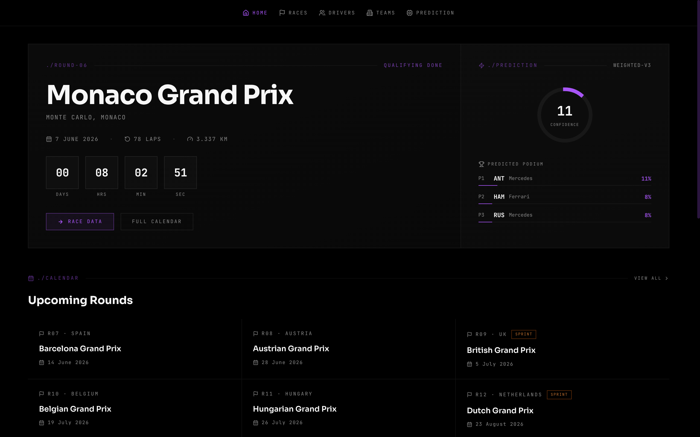

# [F1 Prediction Platform](https://f1.gorkemkaryol.dev/)



F1 race winner prediction using historical and current data via FastF1. A weighted 12-feature scoring model with softmax outputs win probabilities for all drivers before each race. Historical data covers 2000–2025.

## Stack

| Layer | Technology | Host |
|-------|-----------|------|
| Frontend | Astro SSR + Tailwind | Cloudflare Pages |
| API | Hono + Drizzle ORM | Cloudflare Workers |
| Database | Neon PostgreSQL | Neon |
| Data Engine | Python + FastF1 | Render |

## Monorepo Layout

```
f1-prediction/
├── web/           # Astro SSR (output: 'server', Cloudflare adapter)
├── api/           # Hono on Cloudflare Workers (NestJS-style modules)
│   └── src/
│       ├── db/schema/   # Drizzle table definitions (source of truth)
│       └── modules/     # races, drivers, teams, predictions, seasons
├── db/            # Drizzle migrations only
├── data-engine/   # Python ETL batch jobs on Render
│   └── src/jobs/  # sync, ingest, compute jobs
└── docs/          # Architecture, API reference, schema, pipeline, deployment
```

See [CODEMAP.md](./CODEMAP.md) for the full file-level reference and [DECISIONS.md](./DECISIONS.md) for architectural rationale.

## Local Development

### API (Hono — Cloudflare Workers)
```bash
cd api
bun install
bun run dev        # wrangler dev on :8787
```

### Frontend (Astro)
```bash
cd web
bun install
bun run dev        # Astro dev server on :4321
```

### Data Engine (Python)
```bash
cd data-engine
python -m venv venv
source venv/bin/activate
pip install -r requirements.txt
cp .env.example .env   # fill in DATABASE_URL
```

### Database (Drizzle)
```bash
cd api
bunx drizzle-kit push   # apply schema to Neon
```

## ETL Jobs

```bash
cd data-engine
# First-time setup for a season
python src/main.py --job sync_schedule --year 2025
python src/main.py --job sync_season   --year 2025 --round 1

# Weekly pipeline
python src/main.py --job ingest_qualifying   --year 2025 --round 14
python src/main.py --job compute_features    --race_id 42
python src/main.py --job compute_predictions --race_id 42
python src/main.py --job ingest_race         --year 2025 --round 14
python src/main.py --job compute_season_stats --year 2025
```

Historical backfill (2018+ FastF1, pre-2018 Ergast):
```bash
cd data-engine
python run_backfill.py 2000 2025
```

## Environment Variables

| Variable | Service | How to set |
|----------|---------|-----------|
| `DATABASE_URL` | API (Worker) | Cloudflare Workers dashboard → Variables and Secrets → **Secret** |
| `DATABASE_URL` | Data Engine | Render dashboard → Environment Variables |
| `PUBLIC_API_URL` | Frontend | Cloudflare Pages dashboard → Environment Variables |

## Prediction Model

12 features, softmax with temperature T=0.3:

| Feature | Weight |
|---------|--------|
| Car Performance | 22% |
| Long Run Pace | 12% |
| Starting Position | 12% |
| Driver Rating | 10% |
| Win Rate | 10% |
| Reliability | 8% |
| Luck Factor | 8% |
| Sector Strength | 6% |
| Qualifying Delta | 5% |
| Weather Impact | 3% |
| Track Overtake Rate | 2% |
| Position Gain Rate | 2% |

See [docs/prediction-model.md](./docs/prediction-model.md) for full details.

## Deployment

- **API**: push to GitHub → Cloudflare Workers auto-deploys
- **Frontend**: push to GitHub → Cloudflare Pages auto-deploys
- **Data Engine**: Render cron jobs (Sat 22:00 UTC qualifying, Sun 18:00 UTC race)
