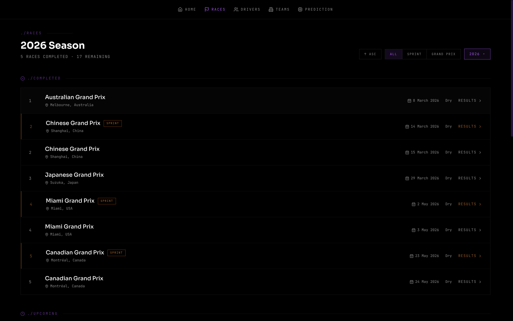
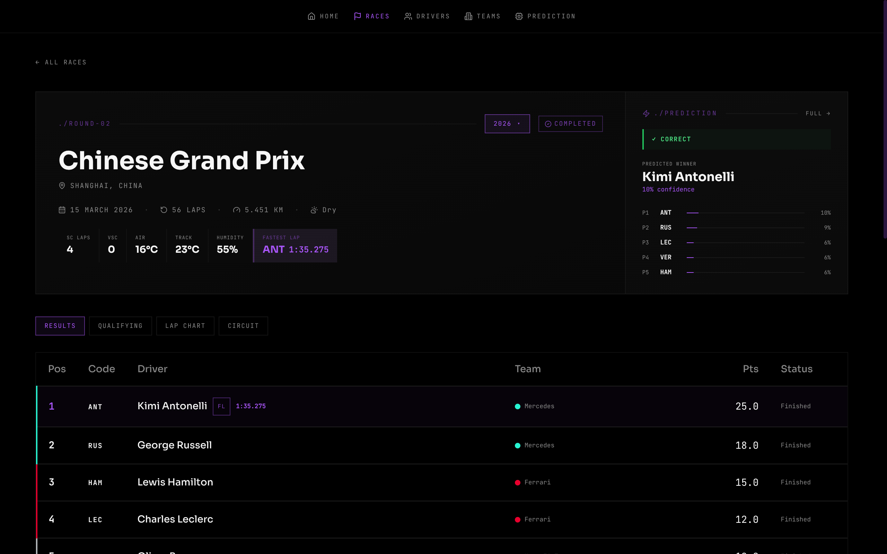

# Architecture

## Monorepo Layout

```
F1-prediction/
├── web/           Astro SSR frontend — Cloudflare Pages
├── api/           Hono REST API — Cloudflare Workers
├── db/            Drizzle migration files only
└── data-engine/   Python ETL batch jobs — Render
```

The schema source of truth lives in `api/src/db/schema/`, not in `db/`.
The `db/` folder holds only the generated SQL migration files.

---

## How the Four Layers Connect

```
┌─────────────────────────────────────────────────┐
│  Browser                                        │
└────────────────────┬────────────────────────────┘
                     │ HTTPS
┌────────────────────▼────────────────────────────┐
│  web/  (Astro SSR — Cloudflare Pages)           │
│  Renders HTML server-side, fetches from API     │
│  in Astro frontmatter (never client-side JS)    │
└────────────────────┬────────────────────────────┘
                     │ HTTP (PUBLIC_API_URL)
┌────────────────────▼────────────────────────────┐
│  api/  (Hono — Cloudflare Workers)              │
│  Read-only REST API, Drizzle ORM queries        │
│  Uses @neondatabase/serverless (HTTP driver)    │
└────────────────────┬────────────────────────────┘
                     │ Neon HTTP
┌────────────────────▼────────────────────────────┐
│  Neon PostgreSQL                                │
│  Shared DB — written by data-engine,            │
│  read by api                                    │
└────────────────────▲────────────────────────────┘
                     │ psycopg2 TCP
┌────────────────────┴────────────────────────────┐
│  data-engine/  (Python — Render cron jobs)      │
│  Fetches F1 data via FastF1, computes           │
│  features and predictions, writes to DB         │
└─────────────────────────────────────────────────┘
```

---

## Key Constraints

**Cloudflare Workers have no TCP.** The `api/` layer must use `@neondatabase/serverless` (HTTP driver). Never use `pg` or `postgres` packages there.

**Python writes directly to Neon.** The API is read-only. There are no write endpoints — the ETL engine connects directly via psycopg2.

**All data fetching in Astro frontmatter.** No client-side data fetching, no React/Vue islands for data. The `---` blocks handle everything server-side.

---

## Data Flow: Conventional Weekend

```
Saturday
  data-engine: ingest_qualifying   → qualifying_results table
  data-engine: compute_features    → driver_prediction_features table
  data-engine: compute_predictions → race_predictions table
  race.status: scheduled → qualifying_done

Sunday
  data-engine: ingest_race         → race_results + lap_times tables
  data-engine: compute_season_stats→ driver_season_stats + team_season_stats
  race.status: qualifying_done → completed
```

## Data Flow: Sprint Weekend

```
Friday
  data-engine: ingest_sprint_qualifying → sprint_results (SQ grid + sq1/sq2/sq3 times)
  data-engine: compute_sprint_features  → driver_sprint_features
  data-engine: compute_sprint_predictions → sprint_predictions
  race.status: scheduled → sprint_qualifying_done

Saturday
  data-engine: ingest_sprint        → sprint_results (finish positions), sprint_lap_times,
                                      races (sprint_weather, sprint_safety_car_laps, etc.)
  data-engine: compute_season_stats → updates sprint aggregates in driver_season_stats
  race.status: sprint_qualifying_done → sprint_done

  data-engine: ingest_qualifying    → qualifying_results
  data-engine: compute_features     → driver_prediction_features
  data-engine: compute_predictions  → race_predictions
  race.status: sprint_done → qualifying_done

Sunday
  data-engine: ingest_race          → race_results + lap_times
  data-engine: compute_season_stats → final season stats
  race.status: qualifying_done → completed
```

---

## Screenshots

**Races calendar**



**Race detail**



---

## Deployment

| Layer | Host | Trigger |
|-------|------|---------|
| `web/` | Cloudflare Pages | Push to `master` → GitHub integration auto-deploys |
| `api/` | Cloudflare Workers | Push to `master` → GitHub integration auto-deploys |
| `data-engine/` | Render | Cron jobs (see `data-pipeline.md` for schedule) |
| DB migrations | Neon | Manual: `bun run drizzle-kit push` from `db/` |
