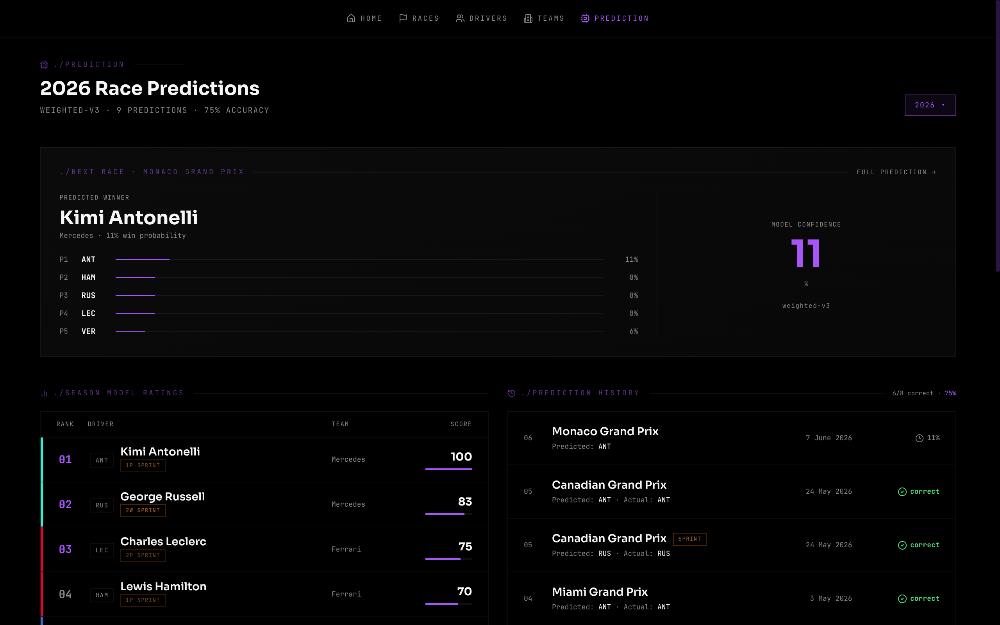
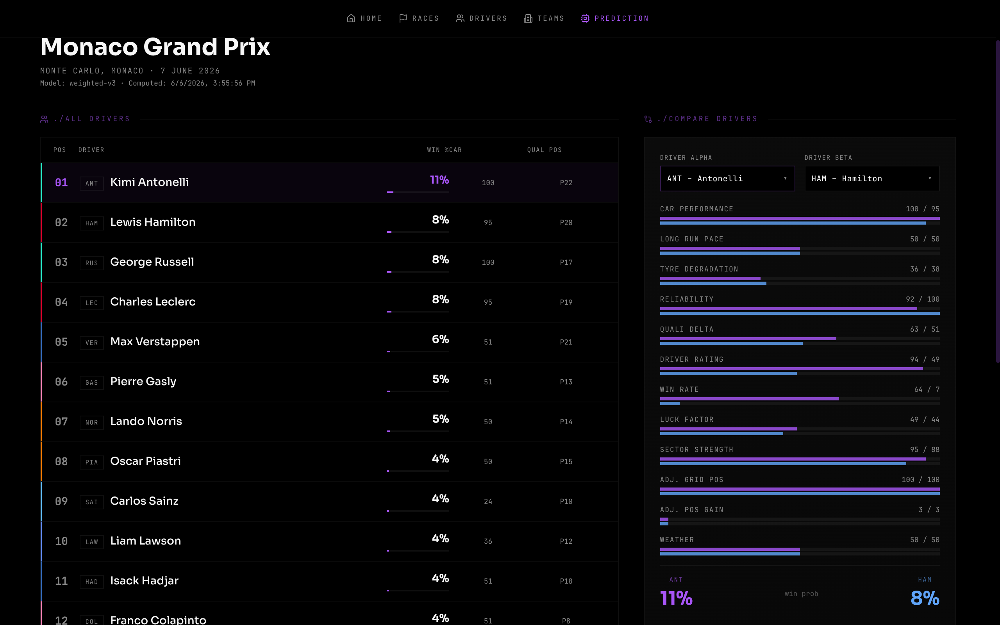

# Prediction Model

## Overview

Two separate models run per race weekend: one for the grand prix, one for the sprint (sprint weekends only). Both use weighted feature scoring + softmax. The features and weights differ because sprint races are a fundamentally different format (~17 laps, no pit stops, track position dominates).

**Prediction standings**



**Race prediction detail**



---

## Where the data comes from

Every feature score ultimately originates from one of three places:

### 1. FastF1 (live F1 session data, Python library)
FastF1 is the sole external data source. It provides telemetry and session data from the official F1 timing feed. The Python ingest jobs pull this data after each session and store it in raw tables.

| FastF1 session | Ingest job | Populates table(s) |
|---------------|-----------|-------------------|
| Race (`'R'`) | `ingest_race` | `race_results` — finish pos, grid pos, status, points |
| Qualifying (`'Q'`) | `ingest_qualifying` | `qualifying_results` — Q1/Q2/Q3 lap times, grid pos, sector times |
| FP2 (`'FP2'`) | `ingest_fp2` | `fp2_long_run_times` — stint median lap times on each compound |
| Race lap data | `ingest_race` | `lap_times` — per-lap time, sector times, tyre compound, tyre life, speed |
| Sprint (`'S'`) | `ingest_sprint` | `sprint_results` — sprint finish pos, points |
| Sprint Qualifying (`'SQ'`) | `ingest_sprint_qualifying` | `sprint_results.sq1/sq2/sq3_time_ms` |
| Sprint lap data | `ingest_sprint` | `sprint_lap_times` — per-lap sprint data |
| Weather | every ingest | `races.weather`, `races.sprint_weather` — `Rainfall` flag from session telemetry |

FastF1 `HeadshotUrl` is used for driver photos (available 2019+, not available earlier).
FastF1 does **not** provide team logos — those are stored as static files in `web/public/teams/`.

### 2. Computed aggregates (run after each race)
`compute_season_stats` reads from the raw tables above and computes season-wide summaries.
These are the inputs for most driver/team-level features.

| Aggregate table | Computed from | Key columns used by features |
|----------------|--------------|------------------------------|
| `driver_season_stats` | `race_results`, `qualifying_results` | `total_points`, `wins`, `races_entered`, `dnf_rate`, `avg_position_gain`, `teammate_quali_delta` |
| `team_season_stats` | `race_results` | `car_performance_score` (normalized avg finish), `reliability_score` (1 − DNF rate) |

### 3. Static / hardcoded
Some inputs never change and are seeded once into the database or hardcoded in Python.

| Value | Where stored | Changes? |
|-------|-------------|---------|
| Circuit overtake rate | `circuits.overtake_rate` | Never — seeded once per track |
| Circuit SC probability | `circuits.sc_probability` | Never — seeded once per track |
| Model weights | `compute_features.py` `WEIGHTS` dict | Only when model is intentionally updated |
| Sprint model weights | `compute_sprint_features.py` `WEIGHTS` dict | Only when model is intentionally updated |
| Softmax temperature T=0.3 | `compute_predictions.py`, `compute_sprint_predictions.py` | Only when model is intentionally updated |

---

## Data pipeline — end-to-end flow

```
FastF1 session
    │
    ▼  (ingest jobs)
raw tables: race_results, qualifying_results, lap_times,
            sprint_results, sprint_lap_times, fp2_long_run_times
    │
    ▼  (compute_season_stats — after each race)
driver_season_stats, team_season_stats
    │
    ├── + qualifying_results (sector times, grid position)
    ├── + lap_times (tyre degradation, long run pace)
    ├── + fp2_long_run_times (FP2 stint data)
    ├── + circuits.overtake_rate  ← static
    └── + circuits.sc_probability ← static
         │
         ▼  (compute_features / compute_sprint_features)
    driver_prediction_features / driver_sprint_features
         │
         ▼  (compute_predictions / compute_sprint_predictions — softmax)
    race_predictions / sprint_predictions
         │
         ▼  (Hono API reads)
    /prediction page — displays win probabilities + feature breakdown
```

---

## Race Status Flow

```
conventional weekend:
  scheduled → qualifying_done → completed
                   │                │
          compute_features    ingest_race
          compute_predictions compute_season_stats

sprint weekend:
  scheduled → sprint_qualifying_done → sprint_done → qualifying_done → completed
                       │                   │               │
              compute_sprint_features  ingest_sprint  compute_features
              compute_sprint_predictions               compute_predictions
```

Main race predictions are computed at `qualifying_done`. Sprint predictions are computed at `sprint_qualifying_done` (after SQ session).

---

## Grand Prix Model — `weighted-v3` — 12 Features

| Feature | Weight | Source |
|---------|--------|--------|
| Car Performance | 20% | `team_season_stats.car_performance_score` — normalized avg finish position across the field |
| Long Run Pace | 15% | **Primary:** FP2 MEDIUM-normalised median stint lap time from `fp2_long_run_times`; **fallback:** historical circuit median from `lap_times` (last 6 visits) |
| Tyre Degradation | 8% | `REGR_SLOPE(lap_time_ms, tyre_life)` over last 4 races at circuit — lower slope = better management = higher score; cross-season via driver code |
| Reliability | 8% | Blend: team reliability score (70%) + driver personal DNF rate (30%) |
| Qualifying Delta | 8% | Recency-weighted (5→1) mean of teammate quali gap across last 5 races — cross-season via driver code |
| Driver Rating | 8% | `driver_season_stats.total_points / races_entered / 25` — capped at 1.0 |
| Win Rate | 8% | Bayesian-smoothed: `(wins + 0.5) / (races + 2)` |
| Luck Factor | 7% | Rolling 5-race delta between actual finish and expected (car rank + grid average) — cross-season |
| Sector Strength | 6% | Best sector time advantage vs field in qualifying, averaged across S1/S2/S3 |
| Circuit-Adj. Starting Position | 7% | Grid position scaled by overtake rate and SC probability: `start_pos × (1 + (1−overtake_rate)) × (1 − 0.3×sc_prob)` — Monaco grid matters ×1.95, Monza ×1.15 |
| Circuit-Adj. Position Gain | 3% | Position gain scaled by overtake rate: `avg_gain × overtake_rate` — zero at Monaco, meaningful at Monza |
| Weather Impact | 2% | Historical avg wet-race finish (cross-season, ≥1 wet race); neutral (0.5) for dry races |

All feature scores are normalized to [0.0, 1.0] using min-max normalization across the driver field for that race.

### Weighted Score

```python
raw = (
    car_perf                  * 0.20 +
    long_run                  * 0.15 +
    tyre_deg                  * 0.08 +
    reliability               * 0.08 +
    quali_delta               * 0.08 +
    driver_rating             * 0.08 +
    win_rate                  * 0.08 +
    luck                      * 0.07 +
    sector_strength           * 0.06 +
    circuit_adj_start_pos     * 0.07 +
    circuit_adj_position_gain * 0.03 +
    weather_score             * 0.02
)
```

`track_overtake_score` is no longer a standalone additive feature — its value is baked into the circuit-adjusted starting position and position gain multipliers.

---

## Sprint Model — `sprint-v2` — 8 Features

Intentionally different from the main race model. Sprint races are ~17 laps with no pit stops — track position and car dominance matter far more than long-run strategy or reliability.

| Feature | Weight | Source |
|---------|--------|--------|
| Car Performance | 25% | `team_season_stats.car_performance_score` |
| Circuit-Adj. Starting Position | 25% | Same multiplier as GP: `start_pos × (1 + (1−overtake_rate)) × (1 − 0.3×sc_prob)` |
| Short Run Pace | 10% | Best SQ lap time (sq1/sq2/sq3_time_ms); falls back to main qualifying if SQ not yet ingested |
| Driver Rating | 10% | Sprint-specific (`sprint_total_points / sprint_races / 8`) when ≥3 sprint races recorded; falls back to main race rating |
| Weather Impact | 8% | Based on `races.sprint_weather`; cross-season historical wet performance |
| Win Rate | 8% | Sprint-specific when ≥3 sprint races recorded; falls back to main race win rate |
| Luck Factor | 8% | Rolling 5-race delta from recent grand prix results — cross-season |
| SQ Qualifying Delta | 6% | Recency-weighted (5→1) mean of SQ teammate gap across last 5 sprint weekends — cross-season |

### Weighted Score

```python
raw = (
    car_perf              * 0.25 +
    circuit_adj_start_pos * 0.25 +
    short_run             * 0.10 +
    driver_rating         * 0.10 +
    weather_score         * 0.08 +
    win_rate              * 0.08 +
    luck                  * 0.08 +
    sq_delta              * 0.06
)
```

Sprint driver rating and win rate use sprint-specific history when ≥3 sprint races are recorded, otherwise fall back to main race stats (scaled to match the 8-point sprint maximum vs 25-point race maximum).

---

## Softmax → Win Probability

```python
exp_s = np.exp(scores / T)
win_probability = exp_s / exp_s.sum()
```

Temperature `T = 0.3`. Lower temperature makes the model more decisive — small score differences produce larger probability gaps. Do not increase T.

Probabilities sum to 1.0 across all drivers in a race. Same temperature applies to both the sprint and main race models.

---

## Predicted Position

Drivers are ranked by `win_probability` descending. Rank 1 = predicted winner, stored in `race_predictions.predicted_winner_id` (or `sprint_predictions.predicted_winner_id` for sprints). All driver positions are stored in `driver_prediction_features.predicted_position` (or `driver_sprint_features.predicted_position`).

---

## Data Availability by Era

| Years | Qualifying data | Lap times | Sprint data |
|-------|----------------|-----------|-------------|
| 2018–present | Full Q1/Q2/Q3 + sector times | Full per-lap telemetry | Full SQ times + sprint lap times |
| 2006–2017 | Q1/Q2/Q3 times | None | N/A (sprint format started 2021) |
| 2000–2005 | Single best lap time only | None | N/A |

For races without qualifying data, `compute_features` cannot run — those races have no predictions.
